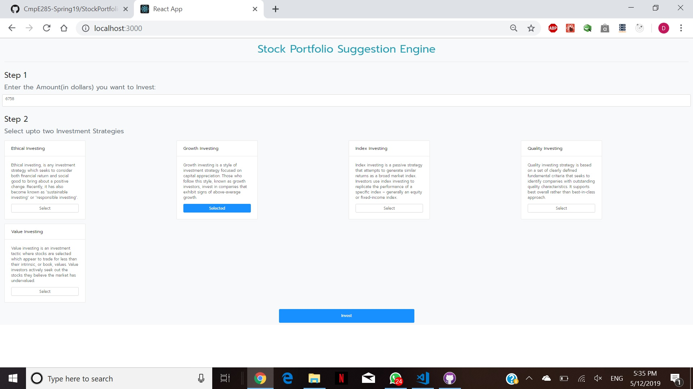
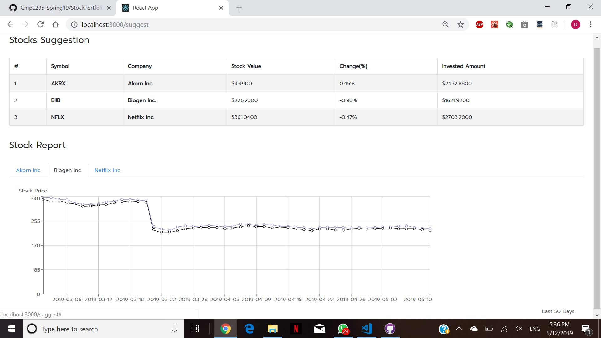

# CmpE285-Spring19
Work done at SJSU for course CmpE285: Software Engineering Processes
Video Link: Coming up

### Steps and Requirements to run this project:
1. Download Python 2.7(Link: https://www.python.org/download/releases/2.7/)
2. pip install
    - requests
    - flask
    - flask-cors
3. Download react dependencies
    - go to /StockPortfolioSuggestion/frontend
    - run npm install
4. Running the client
    - go to /StockPortfolioSuggestion/frontend
    - run npm start
5. Running the server
    - go to /StockPortfolioSuggestion/backend
    - run python api.py

### Usecase
1. Enter any amount and select any strategy. Click on Invest

2. View the suggested stocks and their history

Thank You.